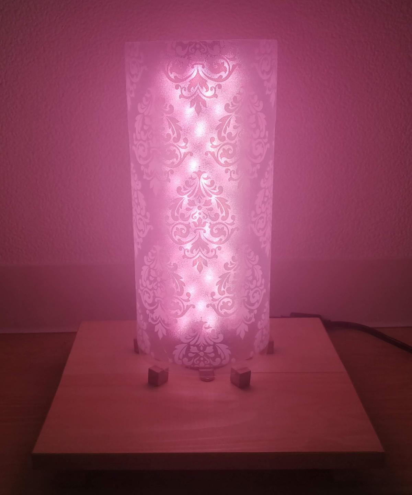
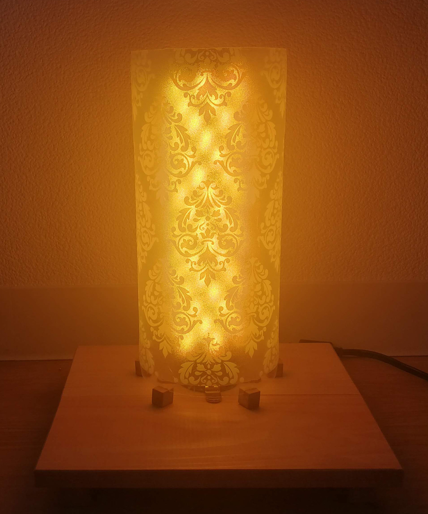
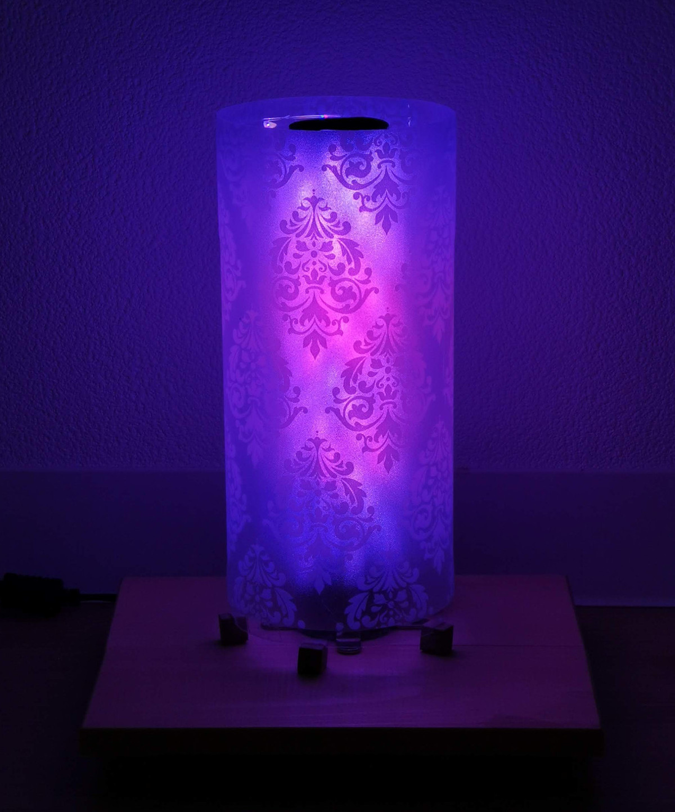
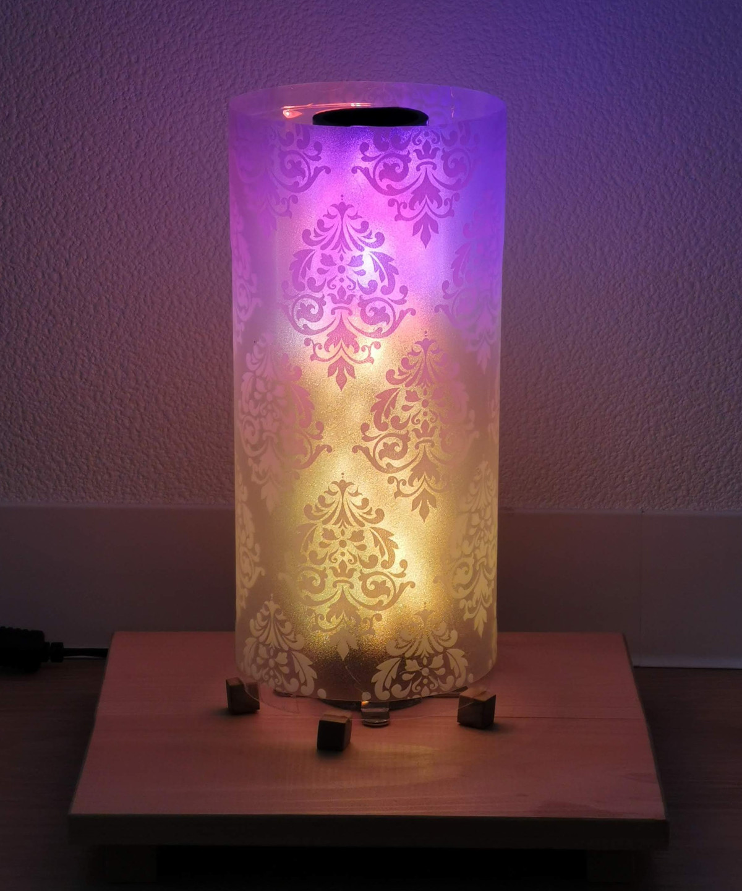

# DIY Bluetooth RGB LED lamp

A blutooth controlled RGB LED lamp with beautiful color effects.

## Features

* Spotify integration. Sets the lamp to a color matching the album art. Similar to how the color of the spotify status bar notification is picked.

* Pick an image from the phone and display it on the lamp.

* Flash lamp whenever the phone receives a new notification, such as when messages, emails etc. are received.

* Various animated effects and mood effects. Night sky, green forest and sunset to name a few.

* Simple RGB color picker in the app.

## Hardware

### Electronics

* 2x [WS2812B RGBW LED strip](https://www.banggood.com/DC5V-1M-5M-WS2812B-RGBW-RGBWW-4-IN-1-Non-Waterproof-5-Pins-LED-Strip-Light-for-Home-Decor-p-1211177.html) from Banggood

* 1x [8A 5V DC power supply](https://www.amazon.co.jp/gp/product/B073VN5HHP) from Amazon JP

* 1x [ESP32-DevKitC V4](https://docs.espressif.com/projects/esp-idf/en/latest/hw-reference/get-started-devkitc.html)

* Capacitor, 3.3V to 5V logic level shifter and resistor. More or less as described in [this guide](https://learn.adafruit.com/neopixel-levelshifter) by Adafruit.

* A switch to easily disconnect the 5V power supply before connecting the ESP32 to the computer for programming.

### Lampshade, stand etc

* The lamp shade is made from a cut PET bottle, and wrapped in a decorative window film found at Daiso in Tokyo. By gluing sawed off pieces of a square wood stick to the bottom of the lamp shade, some air is allowed to flow and cool the LEDs.

* PVC pipe to wrap the led strip around.

* Wooden panel to mount the PVC pipe on. On the bottom side the ESP32 and the rest of the electronics are mounted.

## Software

You can browse the entire code base at github.
[https://github.com/miksto/BluetoothLEDLamp](https://github.com/miksto/BluetoothLEDLamp)

### ESP32

https://github.com/Makuna/NeoPixelBus - the only library supporting RGBW leds AND using DMA (Direct Memory Access) i could find by the time.

DMA is preferred for efficient control of the leds, as opposed to bit bang and interrupt driven libraries which do not support any other interrupt driven code to work.

### Android App

The android application does not use any special libraries, and is written in kotlin and relies on the standard BLE library for communication with the ESP32.

