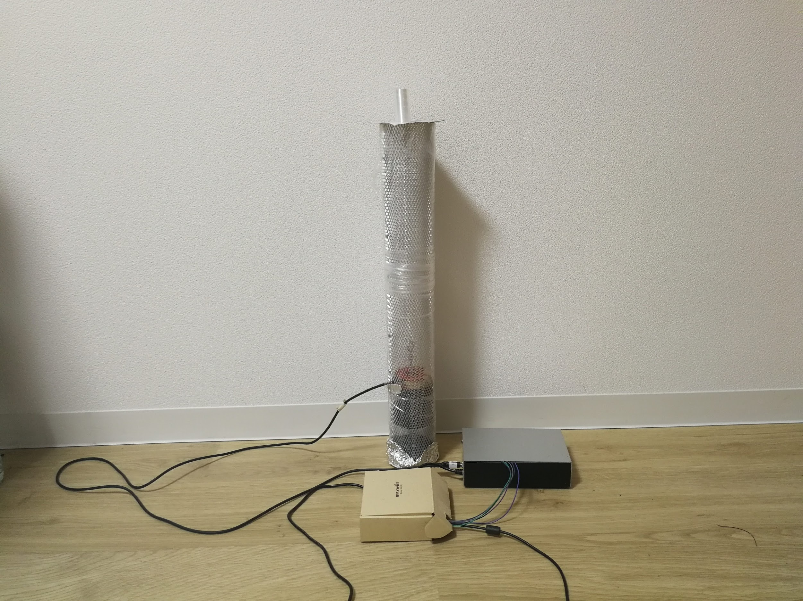
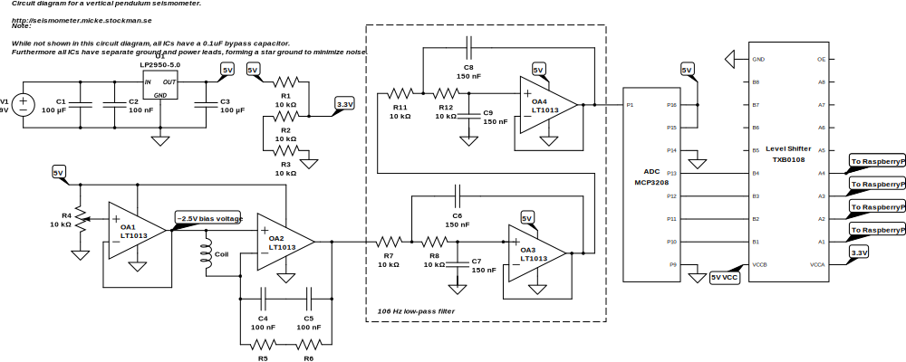

# DIY Seismometer Project

After moving to Tokyo in Japan, a country with about 10 earthquakes per day, I could not help but to get interested in the topic. Keeping a close eye on the Japan Meteorological Agency's webpage (https://www.jma.go.jp/en/quake/), I made sure not to miss any earthquakes in Japan. However, most earthquakes are too distant or too weak for humans to sense them, so to know for sure if what felt like an earthquake actually was an earthquake and not just imagination, you would have to wait for that webage to get updated.
I however, did not have the patience to wait those 5 minutes, and decided to build a seismometer to be able to collect my own data, and view it in real time.

It turned out working beyond my expectations, and I became really excited when I captured an earthquake outside of cost of Australia. Since then I have even been able to capture earthquakes on the other side of the globe, but that is out of the ordinary.

_The seismometer_

_An example of two recorded earthquakes_

## Overview of construction and software

After browsing the internet for different DIY seismometers, I deciede for a vertical pendulum seismometer
based on ease of build. Specifically this page https://tc1seismometer.wordpress.com/ was a great resource for
information on the construction. As for the electronic, this page http://www.infiltec.com/seismo/ was helpful.

In essence the seismometer consists of a magnet suspended by a spring, which will move relative to a coil as the ground moves. When the magnet moves relative to the coil a small current is created which by the use of an op-amp is amplified and represented as a voltage swinging from around 0 to 5 volts. This voltage sampled by an ADC and a RaspberryPi at ~300Hz, and then in software passed through a low pass filter, with a cutoff frequency of about 1.6Hz. The software processing is to a large extent handled by the library obspy, a python library for seismology (https://www.obspy.org/). After the low pass filtering the signal is downsampled from 300 samples per second to a more suitable 15 samples per second and sent to a webserver that stores the data, saves plots as images, and provides an API for the web frontend.

## Construction

Although the materials differ, the general construction principle of this seismometer and the TC1 seismometer are very much alike. The most notable difference being the tube, which I in an attempt to minimize RF noise, was chosen to be a metal mesh rather than an acrylic pixpe. A not of warning here, make sure the metal is NOT magnetig. The same thing goes for the nuts and skrews to clamp the rolled net toghether. The mesh came in a plastic tube, which i kept on in order to prevent moving air from affecting the seismometer.

<<image of rolled net>>

The coils is wound with a <<GAUGE>> wire around a used up tape role, with a large enough inner diameter for my neodymium magnets
to pass trough with some margin. The desired resistance of the coil 700 ohms to 200 ohms according to the TC1 webpage.
My coild turned out a bit short of that, with a resistance of 670 ohms, since the wire snapped while winding the coil.

<<image of coil>>
spole: vilken gauge, vilket motstånd

The spring consists of a plastic spring I deemed suitable, which i found at Tokyu Hands.
The magnets are skrewed into place on a eye bolt, and hung on the spring.

<<image of spring and eye bolt and magnets>>

The final part of the assemly is the dampener which is required to prevent the seismometer to be overly sensitive in its resonant frequency, which is determined by the spring itself and the weight the eye bolt and the magnets.
You want the spring, when pulled and released, to return to and just barely overshoot its resting position before coming to a rest.
<<insert source>>

This is accomplished by a metal pipe placed below the coil, and an extra pair of magnets that extends into the pipe.
A high conductivity metal like copper is a good choice, but with a limited selection I went for a alumiun pipe which also
worked great. Perhaps thanks to its slightly higher thickness. When the magnet inside the pipe moves, eddie currents generated in the pipe will create an opposing magnetic field, and thus dampening the movement.

<<insert image of dampener>>

The coil is held into position by a circular foam pad held into place by the friction against to wall of the rolled metal mesh.
<<imager of foam pad>>

The metal pipe is held into place by two foam pads, one in each end.
The spring is held into place by a piece of stiff paper, and hung from the top of the metal mesh roll.
This could certainly be improved as even a light touch easily knocks the spring and magnets out of position.
<<insert image of paper contraption>>

The the coil a shielded stereo audio cable is used. The shielding is connected to the metal mesh itself, and the two inner cables are attached to each end of the coil. This way, the current from the coil is passed as a differential signal, with a shielding further increasing the noise immunity. When trying to use a mono stereo cable, using the single internal cable and the shielding
to pass the signal the noise level became noticably higher.

<<insert image of coil and cable assembly>>

## Electronics

When designing the electronic circuit, http://www.infiltec.com/seismo/ was my primary source of inspiration. The final circuit does however differ quit a bit, but the working principle remains the same.

_Note: While not shown in the circuit diagram, all ICs have a bypass capacitor, as well as separate power and ground leads, forming a so called star ground._

### Power supply
The circuit is powered by a 9V SMPS, regulated down to 5V by a LP2950.

As specified by the [datasheet](http://www.ti.com/lit/ds/symlink/lp2951-n.pdf) the input side requires a capacitor with a minimum of 1 uF, and the output side a minimum of 1 uF. Without the output capacitor the device will oscillate.
Furthermore, for the regulation to work properly, there is a required minum ESR for the output capacitor. Therefore ceramic capacitors (if used), has to be connected in series with a resistor to simulate the needed ESR.

### OP-Amp

There are two op-amps in this circuit. One creates a ~2.5V bias voltage for the coil, and the other one amplifies the signal from the coil 2000-3000 times.

**The bias voltage:**
When the magnets move up and down through the coil, currents in both directions will be generated depending on the direction of movement. Currents in different directions would mean both positive and negative output voltages by the op-amp, but since we are only using a positive 5V supply rail, the output voltage cannot go below ground. By biasing the coil to 2.5V, the output voltage will swing from 0V - 5V with 2.5V as its resting position. This also a requirement for the ADC that does not work with negative voltages either.
The bias voltage is created with one of the op-amps configured as a voltage follower, to get a low impedence 2.5V source.

**OP-Amp gain / Feedback loop**
The gain of the second op-amp is the fraction of the two feed back resistors and the resistans of the coil. In this case 2MΩ / 571Ω = 3502. The capacitors in the feed back loop forms a low pass filter with a cutoff frequency Fc = 1 / 2πRC = 1(2π\*2MΩ\*50nF) = ~1.59Hz
Ceramic capacitors are known for their piezoelectric effects which may result in increased noise. In low noise filtereing applications such as this case, film capacitors are therefore a better choice.

### Low Pass Filtering

In the original circuit I used an 8 Pole Sallen–Key low pass filter with a cutoff frequency of ~1.59Hz between the op-amp output and the ADC input. However, as I later came to realize, analog filters with such a low cutoff frequency are not all that good, and I abandoned the analog filters and went for a software filter as a post processing step on the RaspberryPi.

Although the software filtering will be covered in detail in the software section, some things need go be covered right away. Without a low pass filter, the signal must be sampled at a much higher frequency than the frequency of the signal of interest, in this case ~1Hz. This is known as [oversampling](https://en.wikipedia.org/wiki/Oversampling). There reason being that noise with all kinds of frequencies will be present, and with a too low sampling rate this noise will be mixed with, and indistinguishable from the actual signal. This effect is known as [Aliasing](https://en.wikipedia.org/wiki/Aliasing).
One step that should further improve this setup and the SNR, which I have not yet implemented, is to combine oversampling with a low pass filter. Such a filter is referred to as an [anti-aliasing filter](https://en.wikipedia.org/wiki/Anti-aliasing_filter). By oversampling the signal, the cutoff frequency of the anti-aliasing filter can be moved to a higher, more suitable frequency, and the damands of the filter are relaxed. Once the filtered signal is sampled, we can in software apply a final filtering and dowsampling stage, suitable for our 1Hz seismometer signal.

For example:
If we sample the ADC at 500Hz, that gives a nyqvist frequency of 250Hz. With an anti-aliasing filter with a cuttoff frequency of let's say 100Hz, the filter has (500/2) - 100 = 150Hz transition band to remove frequencies that would cause aliasing.

### Analog to Digital Converter (ADC)
The ADC currently in use is a MCP3208, a 12 bit ADC with an SPI output for communication with the RaspberryPi.

### Logic Level Shifter
Since the circuit is powered by 5V, and the RaspberryPi IO pins operate at 3.3V, a logic level shifter sits in between the ADC output and the RaspberryPi to tranlate between the two voltages.

Mjukvara
  RaspberryPi
    sampling rate
    filtering
    drift correction
  server
    image generation
    websocket
  web frontent
    reactJs
    

