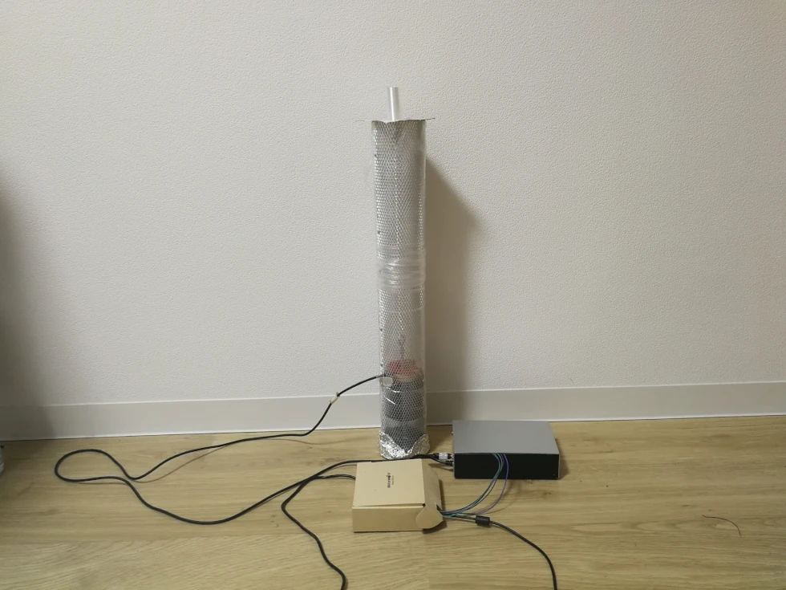
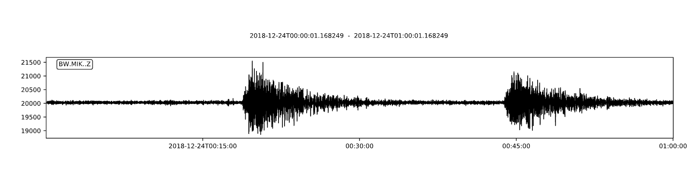
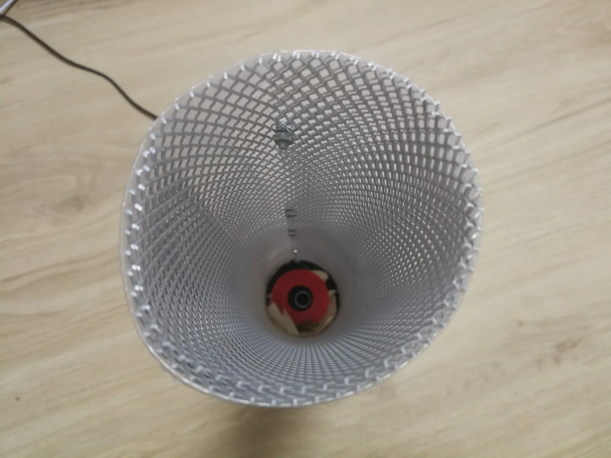
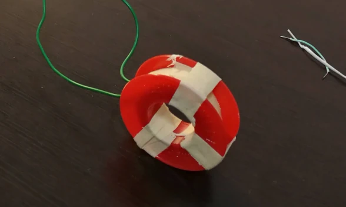
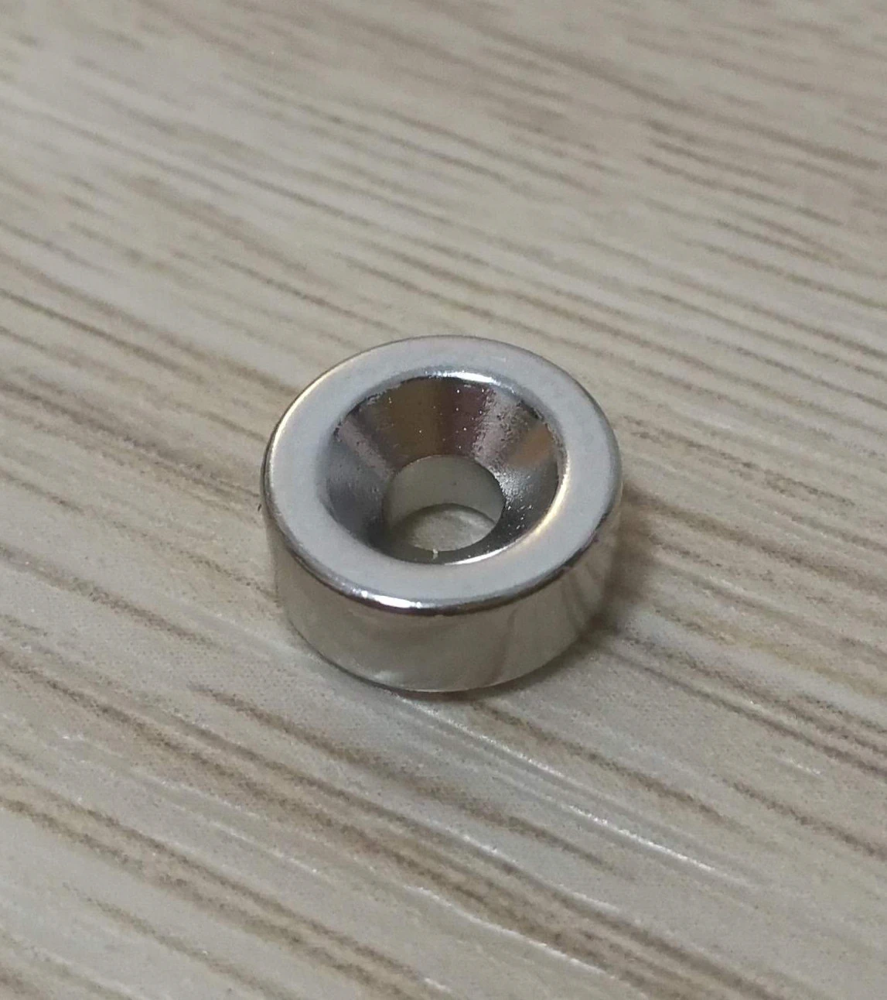
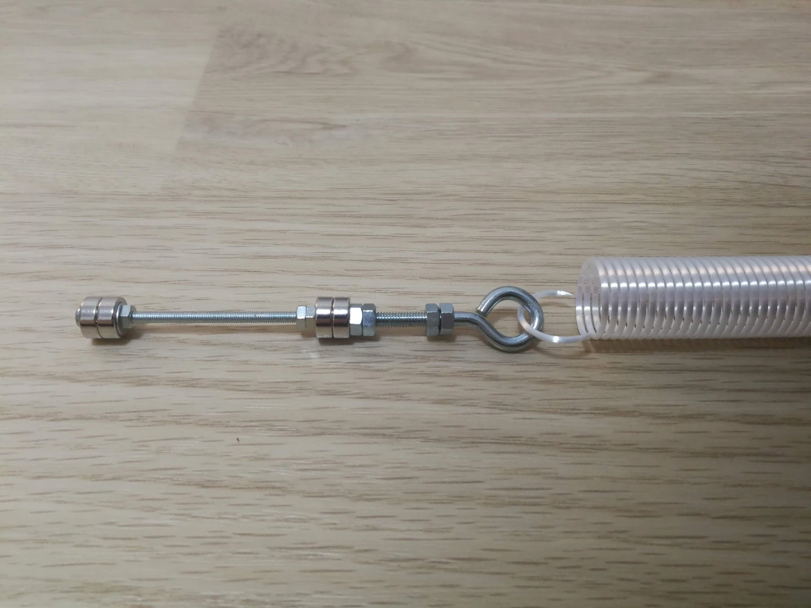
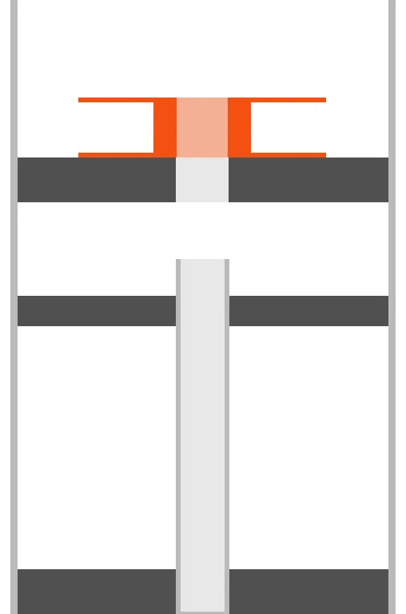
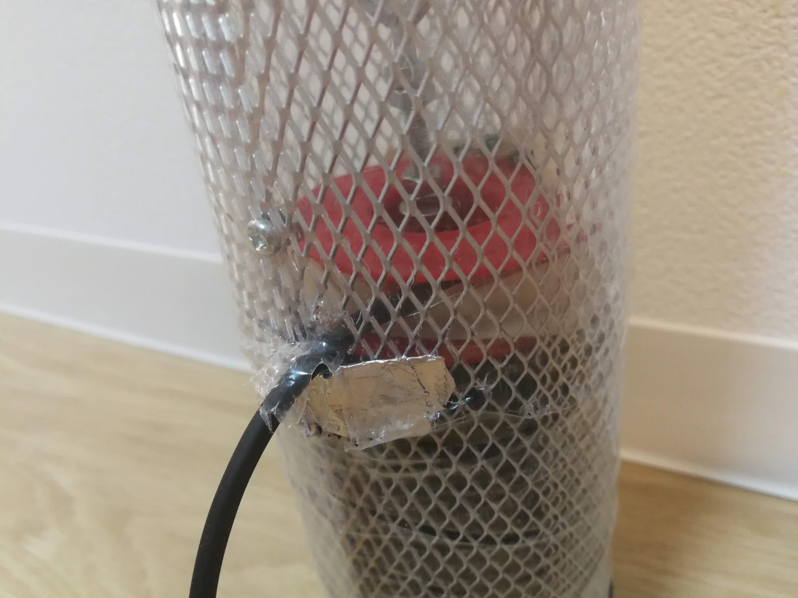
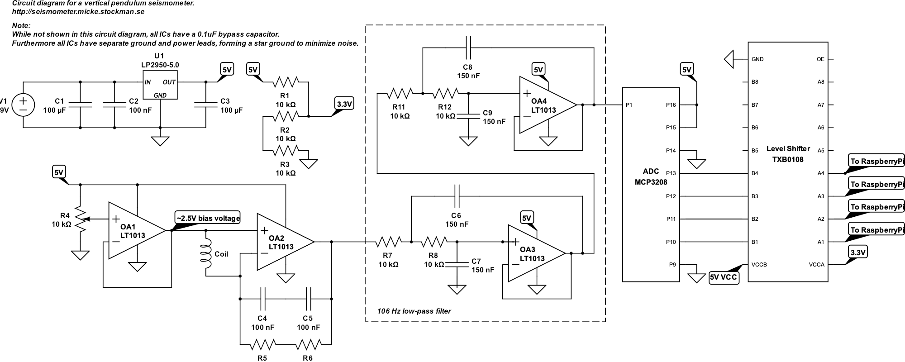

# DIY Seismometer
Building a Global Earthquake-Detecting Seismometer with a Raspberry Pi and Hardware Store Components. 

The documentation consists of three parts

- [The construction of the seismometer](#how-to-build-the-seismometer)
- [The electronics](#electronics)
- [The software](#software)

After moving to Tokyo in Japan, a country with up to 10 earthquakes per day, I could not help but to get interested in the topic. Keeping a close eye on the Japan Meteorological Agency's webpage (https://www.jma.go.jp/en/quake/), I made sure not to miss any earthquake. However, most earthquakes are too distant or too weak for humans to feel, so whenever I felt like there was an earthquake I would check that site to know for sure. The only issue is that the site "only" updates every few minutes. Therefore I decided to build my own seismometer to be able to capture and view data in real time.

The seismometer turned out to work beyond my expectations, and I became really excited when I captured an earthquake outside the coast of Australia. Since then I have even been able to capture earthquakes on the other side of the earth.

_The seismometer_

_An example of two recorded earthquakes_

After browsing the internet for different DIY seismometers, I decided on a vertical pendulum seismometer based on ease of build. Specifically [https://tc1seismometer.wordpress.com/](https://tc1seismometer.wordpress.com/) was a great resource for
information on the construction. As for the electronics, this page [http://www.infiltec.com/seismo/](http://www.infiltec.com/seismo/) was very informative.

In essence the seismometer consists of a magnet suspended by a spring, which will move relative to a coil as the ground moves. When the magnet moves, a small current is generated in the coil, which by the use of an op-amp is amplified and represented as a voltage ranging from around 0V to 5V. This voltage is sampled by an ADC and a RaspberryPi at 750 Hz, and then in software passed through a low-pass filter with a cutoff frequency of about 1.4 Hz. The software processing is to a large extent handled by the library [obspy](https://www.obspy.org/), a python library for seismology. After the low-pass filtering the signal is downsampled from 750 samples per second to a more suitable 15 samples per second and sent to a web server that stores the data, saves plots as images, and provides an API for the web frontend.

# How to build the seismometer

This seismometer is based on the TC1 seismometer, and while the choice of materials differ, the basic construction principles are very much alike. 

## The frame
In an attempt to minimize RF noise, the frame was chosen to be a rolled up metal mesh.  It came in a plastic wrapping which I kept on to protect the seismometer from drafts.
Since we will have magnets inside this tube, make sure the metal mesh and any nuts and screws are made of a non magnetic material. 

  

## The coil

The coil is wound with an AWG 18 wire around an empty tape roll, with a large enough inner diameter for the neodymium magnets to pass through with some margin. The desired resistance of the coil is 700 ohms to 2000 ohms according to the TC1 webpage.
My coil turned out a bit shy of that, with a resistance of 570 ohms as the wire snapped while winding the coil.

  

## Spring and magnets
The spring consists of a plastic spring I deemed suitable, which I found at Tokyu Hands. The neodymium magnets are screwed into place on an eye bolt, and hung on the spring. In the picture you can see two pairs of magnets. The upper pair will be inside the coil and generate the measured signal, and the pair at the end of the bolt is part of the dampener.

 
 

## The dampener
A dampener is required to prevent the seismometer from being overly sensitive in its resonant frequency. Without a dampener even just a small vibration will cause the spring to bounce up and down for a very long time.
You want the spring, when pulled and released, to return to and just barely overshoot its resting position before coming to a rest.

 
 
To get the desired dampening a metal pipe placed below the coil, and the lower pair of magnets extend into the pipe. When the magnets move they produce eddy currents in the pipe, which in turn creates a magnetic field opposing that of the magnet. The end result is a force that opposes the motion of the magnets, and oscillations quickly decay.

A high conductivity metal like copper is a good choice, but with a limited selection I went for a aluminum pipe which also worked great.

## Assembly
The coil is placed on a circular foam pad held in place by the friction against the wall of the rolled metal mesh. The metal pipe is held in place by two foam pads, one in each end.

  

The spring is held in place by a piece of stiff paper, and hung from the top of the metal mesh roll.
This could certainly be improved as even a light touch easily knocks the spring and magnets out of position.

To connect the coil to the electric circuit a shielded stereo audio cable is used. The shielding is connected to the metal mesh itself, and the two inner cables are attached to each end of the coil. This way, the current from the coil is passed as a differential signal, with a shielding further increasing the noise immunity. When I tried to use a mono stereo cable the noise levels were noticeably higher.

  

# Electronics

When designing the electronic circuit, [http://www.infiltec.com/seismo/](http://www.infiltec.com/seismo/) was my primary source of inspiration. Although the final circuit differs quite a bit the working principle remains the same.

_Note: While not shown in the circuit diagram, all ICs have a bypass capacitor, as well as separate power and ground leads, forming a so called star ground._

## Power supply
The circuit is powered by a 9V SMPS, regulated down to 5V by a LP2950.

As specified by the [datasheet](http://www.ti.com/lit/ds/symlink/lp2951-n.pdf) the input side requires a capacitor with a minimum of 1 uF, and the output side a minimum of 1 uF. Without the output capacitor the device will oscillate.
Furthermore, for the regulation to work properly, there is a required minimum ESR for the output capacitor. Therefore ceramic capacitors (if used), have to be connected in series with a resistor to simulate the needed ESR.

## OP-Amp

There are four op-amps in this circuit. One creates a ~2.5V bias voltage for the coil, and another amplifies the signal from the coil 2000-3000 times. The last two ones form a low-pass filter sitting right before the ADC.

### The bias voltage

When the magnets move up and down through the coil, currents in both directions will be generated depending on the direction of movement. Currents in different directions would lead to both positive and negative output voltages by the op-amp, but since we are only using a positive 5V supply rail, the output voltage cannot go below ground. By biasing the coil to 2.5V we are shifting the midpoint from 0V (ground) to right in between ground and the power rail. Thus the output voltage will swing from 0V - 5V with 2.5V as its resting position. This is also a requirement for the ADC that does not work with negative voltages either.
The bias voltage is created with one of the op-amps configured as a voltage follower, to get a low impedance 2.5V source.

_An additional note:_ The above mentioned 2.5V bias voltage is based on the assumption that the op-amp can drive the output voltage all the way down to 0V (ground) and up to 5V (power rail). In practice however, that is rarely the case, and the bias voltage should be set to the middle point between the max and the min output voltages of the op-amp.

### OP-Amp gain / Feedback loop

The gain of the second op-amp is the fraction of the two feedback resistors and the resistance of the coil. In this case 2MΩ / 570Ω = 3509. The capacitors in the feedback loop forms a low-pass filter with a cutoff frequency Fc = 1 / 2πRC = 1(2π\*2MΩ\*50nF) = ~1.59 Hz
Ceramic capacitors are known for their piezoelectric effects which might result in increased noise. In low noise filtering applications such as this case, film capacitors can be a better choice.

## Low-pass Filtering

In the original circuit an 8 Pole Sallen–Key low-pass filter with a cutoff frequency of ~1.59 Hz was used in between the op-amp output and the ADC input. However, as I later came to realize, analog filters with such a low cutoff frequency are not all that good, and I abandoned those analog filters and went for a digital filter as a post processing step on the RaspberryPi. As digital filters do not suffer from the physical limitations of analog filters, they can provide a clean cutoff down to our desired ~1 Hz.

An analog low-pass filter is still desirable though, and the reason is [aliasing](https://en.wikipedia.org/wiki/Aliasing). If noise with a frequency content higher than _half the samplerate_ (the [nyquist frequency](https://en.wikipedia.org/wiki/Nyquist_frequency)) is present, this noise will be mixed with, and indistinguishable from the actual signal. By increasing the sampling rate, so called [oversampling](https://en.wikipedia.org/wiki/Oversampling), a larger portion of the noise can be filtered, but there is always the risk that there is some high frequency noise that cannot be removed.

An effective solution is therefore to combine oversampling with a low-pass filter, a so-called [anti-aliasing filter](https://en.wikipedia.org/wiki/Anti-aliasing_filter). By oversampling the signal, the cutoff frequency of the anti-aliasing filter can be moved to a higher, more suitable frequency, and the demands of the filter are relaxed. Once the filtered signal is sampled, we can apply the digital low pass filter, and then dowsample the signal to a rate suitable for our 1 Hz seismometer signal. A final sample rate of about 10 times the frequency of the signal of interest will do fine.

>Current setup:
>The ADC is sampled at 750 Hz, and a 4 pole sallen-key low-pass filter with a cutoff frequency of about 106 Hz is used.
>With a nyquist frequency of 375 Hz, the filter has a 375-106=269 Hz transition band to remove frequencies that would cause aliasing.

## Analog to Digital Converter (ADC)

The ADC currently in use is a MCP3208, a 12 bit ADC with an SPI output for communication with the RaspberryPi.

## Logic Level Shifter

Since the circuit is powered by 5V and the RaspberryPi IO pins operate at 3.3V, a logic level shifter sits in between the ADC output and the RaspberryPi translating between the two voltages.

# Software

The software consists of three pieces.

- The client running on the RaspberryPi, that samples the ADC and sends the data to the server.
- The web server that stores the data as files and provides an API for the web frontend.
- The web frontend showing various plots of the last 24 hours of data, as well as a graph that in near real-time shows data as it is received by the server.

## Client

You can find the source code of the script [here at GitHub](https://github.com/miksto/seismograph-backend/blob/master/seism_logger.py)

The client is a python script running on the RaspberryPi which makes use of [obspy](https://www.obspy.org/), a framework for processing seismological data.

The script collects 10 seconds worth of data with a sample rate of 750 samples per second. The data is then passed through a digital filter with a cutoff frequency of 1.4 Hz.
After the low-pass filter, the data is downsampled from the 750 samples per second to 15 samples per second. As the final step the data points are rounded to integers, and sent via a websocket to the server.

### Average value and drift

We want the average of the collected data points to be zero, which would be a very straightforward task, if not for the temperature offset voltage drift inherent to op-amps. As the temperature in the room varies, so will the output voltage of an op-amp.
Therefore, to ensure that the average value stays at zero and doesn't drift as the temperature changes, some extra measures need to be taken.
The approach in this project is to keep a rolling 2 minute average of the sampled values, and subtract this rolling average from every sampled datapoint. Perhaps not the most elegant or sophisticated solution, but despite its simplicity it works just fine.

## Server

You can find the source code [here at GitHub](https://github.com/miksto/seismograph-backend)

As for the server software I am not going to cover it in that much detail, as I do not really think it is interesting. It is hosted on a DigitalOcean droplet as docker image. And just as the RaspberryPi client, it is written in python and uses [obspy](https://www.obspy.org/) for the data processing.
It listens for data on a websocket, stores the data in an MSEED file per day, while hourly generating and saving a plot of the last hour as an image. Finally, at the end of each day a 24 hour plot is generated, where any major earthquake is displayed with location and magnitude printed.
The websocket does not only receive data, but also broadcasts it to any listening client. This is used by the web frontend to update the graph as soon as data is received by the server.

## Web App

You can find the source code [here at GitHub](https://github.com/miksto/seismograph-web-frontend)

Just like the server application, I do not think an in depth explanation is going to be all that useful. For anyone interested in the details there is the source code.
The web app is a node application powered by reactJS, and hosted
on Heroku.
In principle the web site consists of four parts:

- A near real-time graph that listens to the websocket to always show the latest data received by the server.
- A plot of the last 60 minutes, which is updated every minute.
- A 24 hour plot of the previous day, with major earthquakes pointed out with location and magnitude.
- A list with 24 plots of the last 24 hours. One plot for each hour.
