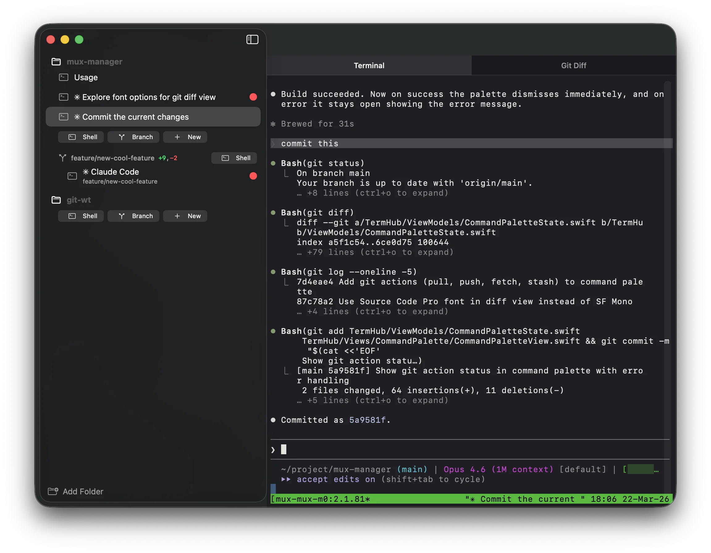

# TermHub

A native macOS app for managing terminal sessions across multiple project folders with automatic git worktree support.

## Motivation

TermHub was created to make it easier to run multiple [Claude Code](https://docs.anthropic.com/en/docs/claude-code) sessions in parallel across different git repos and worktrees. When working with AI-assisted coding, it's common to have several Claude sessions going at once -- each working on a separate task in its own branch. TermHub keeps all of those sessions organized, makes it easy to switch between them, and notifies you the moment a session finishes or needs attention.

## Features

* **Multi-folder terminal management** -- Organize terminal sessions by project folder. Sessions persist automatically across restarts.

* **Git worktree integration** -- Create worktrees from existing branches or new ones via a built-in branch picker with fuzzy search. Includes an inline diff viewer and per-session change indicators in the sidebar.

* **Tmux-backed sessions** -- Each session runs in tmux, so your work survives app restarts.

* **Command palette** -- `⌘P` to quickly access actions, sessions, and branches.

* **Embedded terminal** -- Full terminal emulator powered by SwiftTerm.

* **Bell notifications** -- Sessions that emit BEL show an attention badge in the sidebar, useful for getting notified when long-running tasks complete.

## Technology

TermHub is written in Swift and targets macOS 14.0 (Sonoma) or later. It uses [SwiftTerm](https://github.com/migueldeicaza/SwiftTerm) for terminal emulation and tmux as the session backend to ensure persistence.

The project uses XcodeGen for Xcode project generation from a `project.yml` configuration file.

## Source Code

You can browse the entire code base on GitHub.
[https://github.com/miksto/TermHub](https://github.com/miksto/TermHub)
